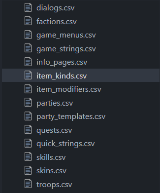

# 骑砍战团 mod 制作教程

## 操作环境

1. python版本:2.7.17
2. 电脑: win10
3. 骑砍版本: 1.174

## 快速开始

进入modules_info文件,修改

```py
export_dir = mod地址
```

## 语言

Mount&Blade Warband\Modules\Test Mod\languages\cns



1. 武器: item_kinds
2. 兵种: troops
3. 技能: skills

## 兵种

module_troops.py

这里具体查看troops这个数组，数组的每一项对应一个兵种

例如: 诺德新兵

```py

[   
    # id 名称 名称复数
    "nord_recruit","Nord Recruit","Nord Recruits",
    tf_guarantee_boots|tf_guarantee_armor,0,0,fac_kingdom_4,
    # 物品
    [
        itm_axe,
        itm_hatchet,
        itm_spear,
        itm_tab_shield_round_a,
        itm_tab_shield_round_a,
        itm_blue_tunic,
        itm_coarse_tunic,
        itm_hide_boots,
        itm_nomad_boots
    ],
    # 等级
    def_attrib|level(6),
    # 属性 # wp_one_handed () | wp_two_handed () | wp_polearm () | wp_archery () | wp_crossbow () | wp_throwing ()
    wp(50),
    # 初始点数
    knows_power_strike_1|knows_power_throw_1|knows_riding_1|knows_athletics_1,
    nord_face_younger_1, 
    nord_face_old_2
],
```

解释

1. Troop id (string): used for referencing troops in other files. The prefix trp_ is automatically added before each troop-id .
部队 ID（字符串）：用于在其他文件中引用部队。 前缀 trp_ 会自动添加到每个 troop-id 之前。
2. Troop name (string).
部队名称（字符串）。
3. Plural troop name (string).
复数部队名称（字符串）。
4. Troop flags (int). See header_troops.py for a list of available flags
部队旗帜 (int)。 有关可用标志的列表，请参见 header_troops.py
5. Scene (int) (only applicable to heroes) For example: scn_reyvadin_castle|entry(1) puts troop in reyvadin castle's first entry point
Scene (int) (仅适用于英雄) 例如：scn_reyvadin_castle|entry(1) 将部队放在reyvadin城堡的第一个入口点
6. Reserved (int). Put constant "reserved" or 0.
保留（整数）。 将常量“保留”或 0。
7) Faction (int)
派系（整数）
8. Inventory (list): Must be a list of items
Inventory（清单）：必须是物品清单
9. Attributes (int): Example usage:
           str_6|agi_6|int_4|cha_5|level(5)
属性: 力量，敏捷，智力，魅力
10. Weapon proficiencies (int): Example usage:
           wp_one_handed(55)|wp_two_handed(90)|wp_polearm(36)|wp_archery(80)|wp_crossbow(24)|wp_throwing(45)
     The function wp(x) will create random weapon proficiencies close to value x.
     To make an expert archer with other weapon proficiencies close to 60 you can use something like:
           wp_archery(160) | wp(60)
武器熟练度（int）：用法示例：
            单手(55)|双手(90)|长柄(36)|射箭(80)|弩(24)|投掷(45)
      函数 wp(x) 将创建接近值 x 的随机武器熟练度。
      要使其他武器熟练度接近 60 的专业弓箭手，您可以使用以下方法：
            wp_射箭(160) | 可湿性粉剂(60)
11. Skills (int): See header_skills.py to see a list of skills. Example:
           knows_ironflesh_3|knows_power_strike_2|knows_athletics_2|knows_riding_2
技能 (int)：查看 header_skills.py 以查看技能列表。 例子：
            knows_ironflesh_3|knows_power_strike_2|knows_athletics_2|knows_riding_2
12. Face code (int): You can obtain the face code by pressing ctrl+E in face generator screen
人脸码（int）：在人脸生成界面按ctrl+E即可获取人脸码
13. Face code (int)(2) (only applicable to regular troops, can be omitted for heroes):
     The game will create random faces between Face code 1 and face code 2 for generated troops
面码（int）（2）（仅适用于正规部队，英雄可省略）：
      游戏会为生成的部队在面部代码 1 和面部代码 2 之间创建随机面部
14. Troop image (string): If this variable is set, the troop will use an image rather than its 3D visual during the conversations
部队图像（字符串）：如果设置了此变量，部队将在对话期间使用图像而不是其 3D 视觉效果

## 物品

module_items

这里具体看items这个数组

item_name, mesh_name, item_properties, item_capabilities, slot_no, cost, bonus_flags, weapon_flags, scale, view_dir, pos_offset

项目名，
网格名称，
项目属性，
项目能力，
插槽号，
成本，
奖金
旗帜
武器
旗帜，
规模，
查看目录，
位置偏移

例子:

```py
 ["tutorial_arrows","Arrows", [("arrow",0),("flying_missile",ixmesh_flying_ammo),("quiver", ixmesh_carry)], itp_type_arrows, itcf_carry_quiver_back, 0,weight(3)|abundance(160)|weapon_length(95)|thrust_damage(0,pierce)|max_ammo(20),imodbits_missile],
```

## 触发器

module_triggers

####################################################################################################################
  Each trigger contains the following fields:
 1) Check interval: How frequently this trigger will be checked
 2) Delay interval: Time to wait before applying the consequences of the trigger
    After its conditions have been evaluated as true.
 3) Re-arm interval. How much time must pass after applying the consequences of the trigger for the trigger to become active again.
    You can put the constant ti_once here to make sure that the trigger never becomes active again after it fires once.
 4) Conditions block (list). This must be a valid operation block. See header_operations.py for reference.
    Every time the trigger is checked, the conditions block will be executed.
    If the conditions block returns true, the consequences block will be executed.
    If the conditions block is empty, it is assumed that it always evaluates to true.
 5) Consequences block (list). This must be a valid operation block. See header_operations.py for reference. 
每个触发器包含以下字段：
  1) Check interval：多久检查一次这个trigger
  2) 延迟间隔：应用触发结果之前等待的时间
     在其条件被评估为真之后。
  3) 重新布防间隔。 应用触发器的结果后必须经过多长时间才能使触发器再次激活。
     您可以将常量 ti_once 放在这里以确保触发器在触发一次后不会再次激活。
  4) 条件块（列表）。 这必须是一个有效的操作块。 请参阅 header_operations.py 以供参考。
     每次检查触发器时，都会执行条件块。
     如果条件块返回真，结果块将被执行。
     如果条件块为空，则假定它始终计算为真。
  5）后果块（列表）。 这必须是一个有效的操作块。 请参阅 header_operations.py 以供参考。
####################################################################################################################

